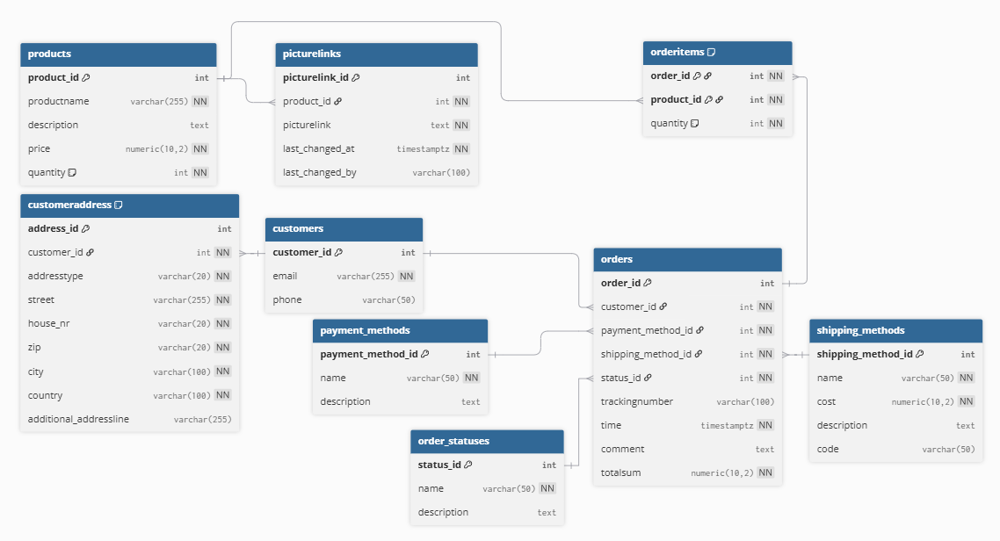

# IShop  
### DHBW Portfolio Project – Modern Distributed E-Commerce System

iShop ist ein moderner, modular aufgebauter E-Commerce-Prototyp, entwickelt im DHBW-Modul **Verteilte Systeme**.  
Das Projekt demonstriert eine serviceorientierte Architektur mit:

- **Static Frontend (HTML, CSS, JS)**
- **REST Backend (Node.js + Express)**
- **Redis Cache** für sessionbasierte Warenkörbe
- **PostgreSQL Datenbank** für persistente Geschäftsobjekte

---

# Inhaltsverzeichnis

1. [Features](#features)  
2. [Architekturüberblick](#architekturüberblick)  
3. [Projektstruktur](#projektstruktur)  
4. [Frontend](#frontend)  
5. [Backend](#backend)  
6. [Datenbank](#datenbank)  
7. [Redis & Caching](#redis--caching)  
8. [Environment-Konfiguration](#environment-konfiguration)  
9. [Setup & Installation](#setup--installation)  
10. [How to Run](#how-to-run)  
11. [Future Work](#future-work)

---

# Features

- Dynamischer Produktkatalog  
- Session-basierter Warenkorb in Redis  
- REST-API für Produkte, Warenkorb, Versandarten, Checkout und Bestellungen  
- Vollständiger Checkout-Flow:
  - Kundendaten  
  - Rechnungs-/Lieferadresse  
  - Versandart (DB-gesteuert)  
  - Zahlungsart (Prepaid + Mock PayPal)
- PostgreSQL-Datenbank (voll normalisiert)
- Order Confirmation Page:
  - Bestellstatus  
  - Trackingnummer  
  - Artikelübersicht  
  - Lieferadresse auf einer Live-Karte (OpenStreetMap + Leaflet)  

---

# Architekturüberblick

iShop folgt einem **klar getrennten Schichtenmodell**:

```
Frontend (Static HTML/CSS/JS)
        ↓ REST
Backend (Node.js + Express)
        ↓
PostgreSQL (Persistent Data)
Redis (Session Cache)
```

---

# Projektstruktur

```
IShop/
├─ backend/
│  ├─ server.js
│  ├─ config/
│  │  ├─ db.js
│  │  ├─ redisClient.js
│  │  └─ paypalClient.js
│  ├─ routes/
│  │  ├─ products.js
│  │  ├─ shipping.js
│  │  ├─ cart.js
│  │  ├─ checkout.js
│  │  └─ orders.js
│  ├─ package.json
│  └─ package-lock.json
│
├─ frontend/
│  ├─ html/
│  │  ├─ index.html
│  │  ├─ checkout.html
│  │  └─ order-confirmation.html
│  ├─ app.js
│  ├─ checkout.js
│  ├─ checkout-session-cart.js
│  ├─ checkout-validation.js
│  ├─ order-confirmation.js
│  ├─ style.css
│  ├─ images/
│  ├─ package.json (optional)
│  └─ package-lock.json (optional)
│
├─ db-schema.png
├─ .gitignore
└─ README.md
```

---

# Frontend

**Technologien:**  
HTML, CSS, JavaScript

## Module

### **1. Shopfront**
- Produkte werden dynamisch über `/api/products` geladen  
- "Add to cart"-Buttons aktualisieren den Redis-Warenkorb  

### **2. Warenkorb**
- Anzeige aller Cart-Items  
- Mengenänderung  
- Entfernen von Artikeln  
- Zwischensummen & Gesamtsumme  

### **3. Checkout**
- Vollständiges Formular für:
  - Kundendaten
  - Lieferadresse
  - Rechnungsadresse
  - Versandoptionen  
- Zahlungsarten:
  - Prepaid  
  - Mock PayPal

### **4. Order Confirmation**
- Wird nach erfolgreichem Checkout geladen  
- Holt Orderdaten via `/api/orders/:orderId`  
- Zeigt:
  - Bestell-ID  
  - Datum  
  - Gesamtbetrag  
  - Artikel  
  - Trackingnummer  
  - Status  
  - Lieferadresse & Rechnungsadresse  
- Rendert eine Karte der Lieferadresse mit Leaflet

---

# Backend

**Technologien:**  
Node.js, Express

## Verantwortlichkeiten

- REST-APIs bereitstellen:
  - `/api/products`
  - `/api/cart/:sessionId`
  - `/api/shipping-methods`
  - `/api/checkout`
  - `/api/orders/:orderId`
- Integration mit PostgreSQL (Persistenz)
- Integration mit Redis (Cart Caching)
- Mock-PayPal-Workflow

---

# Datenbank

Die PostgreSQL-Datenbank ist vollständig normalisiert.  
Das ER-Diagramm zeigt alle Tabellen und Relationen:



## Wichtige Tabellen

- **products**
- **picturelinks**
- **customers**
- **customeraddress**
- **orders**
- **orderitems**
- **payment_methods**
- **shipping_methods**
- **order_statuses**

### SQL-Initialisierung

Export per pgAdmin4:

**Backup → Format: Plain → `db/init.sql`**

Danach im Query Tool ausführen.

---

# Redis & Caching

**Key-Pattern:**

```
cart:{sessionId}
```

**Value:**

```json
{
  "1": 2,
  "3": 1
}
```

---

# Environment-Konfiguration

Im Ordner **backend/** muss eine `.env` liegen:

```env
# PostgreSQL
PGHOST=localhost
PGPORT=5432
PGUSER=postgres
PGPASSWORD=your_password
PGDATABASE=ishop

# Redis
REDIS_HOST=localhost
REDIS_PORT=6379

# PayPal Mock / Sandbox
PAYPAL_CLIENT_ID=your_client_id
PAYPAL_CLIENT_SECRET=your_secret
PAYPAL_ENV=sandbox
```

---

# Setup & Installation

## 1. Repository klonen

```bash
git clone https://github.com/SteffenWaldvogel/IShop.git
cd IShop
```

## 2. PostgreSQL einrichten

```sql
CREATE DATABASE ishop;
```

Dann `db/init.sql` importieren.

## 3. Redis starten

```bash
redis-server
```

## 4. Backend installieren & starten

```bash
cd backend
npm install
node server.js
```

Backend erreichbar unter:

```
http://localhost:3000
```

## 5. Frontend starten

Mit VS Code Live Server  
oder:

```bash
cd frontend/html
npx http-server .
```

---

# How to Run (Kurzfassung)

1. PostgreSQL starten  
2. Redis starten  
3. `.env` erstellen  
4. Backend starten  
5. Frontend öffnen  

---

# Future Work

- Benutzeraccounts  
- Admin-Panel  
- Modernes UI  
- Erweiterter Bestellstatus  
- Weitere Zahlungsanbieter  
